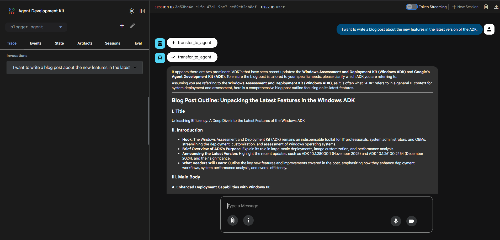
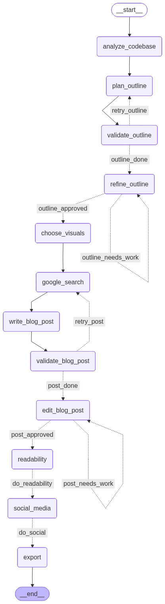

# Blogger Agent



Blogger Agent is a multi-agent technical writing assistant built with the [Google Agent Development Kit (ADK)](https://google.github.io/adk-docs/). It helps you plan, draft, edit, and export technical blog posts through an interactive, iterative workflow powered by specialized AI sub-agents.

## How to Interact with the Agent

There are two ways to interact with Blogger Agent, depending on your preferred interface:

### 1. Web-Based UI (Recommended for most users)
Launch the ADK's built-in playground — a browser-based chat interface — by running:
```bash
uv run adk web
```
Then open your browser to `http://localhost:8000`. You'll see a conversational UI where you can type prompts, review agent responses, and guide the blog-writing workflow interactively. This is the easiest way to get started and gives you a clean, visual interface for the full multi-step process.

### 2. CLI-Based Interaction
If you prefer to work entirely in the terminal, run the agent directly from the command line:
```bash
uv run adk run blogger_agent
```
The agent will prompt you for input at each workflow step — outline approval, draft review, feedback, and export — all from your terminal session. This is useful for scripted workflows or environments without a browser.

---

## Requirements

- Python 3.12+
- A Google Gemini API key (for Google AI Studio) or Vertex AI credentials
- [uv](https://github.com/astral-sh/uv) (recommended for dependency management)

## Configuration

This project loads environment variables from a local `.env` file (via `python-dotenv`). Create a `.env` file in the repository root and set at least:

```bash
GOOGLE_API_KEY=YOUR_API_KEY
```

Optional settings:

```bash
# Force AI Studio credentials instead of Vertex AI
GOOGLE_GENAI_USE_VERTEXAI=False
```

Model defaults (for the worker and critic agents) are configured in `blogger_agent/config.py`.

---

## Quickstart (recommended: uv)

This repo is set up to work well with [uv](https://github.com/astral-sh/uv) for fast, reproducible dependency management.

### 1) Install uv

```bash
pip install uv
```

### 2) Install dependencies

Option A — from `pyproject.toml` (preferred):
```bash
uv sync
```

Option B — from `requirements.txt`:
```bash
uv pip install -r requirements.txt
```

### 3) Set up your `.env`

Copy or create a `.env` file in the root directory and add your API key:
```bash
GOOGLE_API_KEY=YOUR_API_KEY
```

### 4) Run the agent

**Web UI (browser-based):**
```bash
uv run adk web
```
Open `http://localhost:8000` in your browser to start chatting with the agent.

**CLI (terminal-based):**
```bash
uv run adk run blogger_agent
```

---

## Tests and Evaluation

Run the integration test to verify the agent pipeline end-to-end:
```bash
uv run python -m tests.test_agent
```

Run the evaluation smoke test against sample inputs:
```bash
uv run pytest eval/test_eval.py
```

---

## Project Structure

```
blogger_agent/
├── agent.py              # Main orchestrator agent and wiring
├── config.py             # Model and research configuration
├── tools.py              # Custom tools (file export, readability, codebase analysis)
└── sub_agents/
    ├── blog_planner.py       # Generates blog post outlines
    ├── blog_writer.py        # Writes drafts from approved outlines
    ├── blog_editor.py        # Revises drafts based on feedback
    └── social_media_writer.py # Generates promotional posts

eval/                     # Evaluation framework and datasets
tests/                    # Integration tests
```

---

## Architecture

The system consists of a main orchestrator agent that manages the end-to-end workflow and delegates to specialized sub-agents. Each sub-agent handles one stage of the writing process.



### Main Agent

**`interactive_blogger_agent`** — The primary user-facing agent. It interprets your inputs, coordinates the workflow, and routes tasks to the appropriate sub-agent at each stage.

### Sub-Agents

| Agent | Responsibility |
|---|---|
| `robust_blog_planner` | Generates an outline and iterates until it passes validation |
| `robust_blog_writer` | Writes the full blog post from an approved outline |
| `blog_editor` | Applies targeted revisions based on user feedback |
| `social_media_writer` | Creates social media copy (Twitter/X, LinkedIn, etc.) for the final article |

---

## Tools

Custom tools are defined in `blogger_agent/tools.py`:

- **`save_blog_post_to_file`** — Exports the final blog post to a Markdown (`.md`) file.
- **`analyze_codebase`** — Summarizes a codebase directory to provide writing context for technical posts.
- **`readability_scorer`** — Computes Flesch–Kincaid readability metrics and highlights complex sentences and paragraph structure.

The agent can also use the built-in **`google_search`** tool when enabled by the runtime, allowing it to pull in up-to-date references and facts during the writing process.

---

## Workflow

The agent guides you through the following steps:

1. **Analyze codebase** *(optional)* — Point the agent at a codebase to extract context for your post.
2. **Generate outline** — The planner agent proposes a structured blog outline.
3. **Refine outline** — Review and give feedback; the agent iterates until you approve.
4. **Choose visual handling** — Decide whether to include image/diagram placeholders or skip visuals.
5. **Write draft** — The writer agent produces a full draft from the approved outline.
6. **Edit iteratively** — Request changes and the editor agent applies them; repeat until satisfied.
7. **Generate social media posts** *(optional)* — Create ready-to-post promotional content.
8. **Export to Markdown** — Save the final post as a `.md` file on disk.

---

## Example

**User (Web UI or CLI):**
> I want to write a blog post about Gemini 2.5 Flash.

**Agent:**
> Here's an outline proposal for your review:
>
> 1. Introduction — What is Gemini 2.5 Flash and why it matters
> 2. Key capabilities — Speed, efficiency, and multimodal support
> 3. Benchmark comparisons — How it stacks up against other models
> 4. Use cases — Where Gemini 2.5 Flash shines in production
> 5. Getting started — API access and quick example
> 6. Conclusion
>
> Does this outline work for you, or would you like to adjust any sections?

---

## Troubleshooting

**Agent doesn't respond in the web UI?**
Make sure `GOOGLE_API_KEY` is correctly set in your `.env` file and that you've run `uv sync` to install all dependencies.

**CLI hangs or exits immediately?**
Check that `blogger_agent/` is recognized as a Python package (it should contain an `__init__.py`). Also verify your Python version is 3.12+.

**Readability tool fails?**
The `readability_scorer` tool requires the `textstat` library. Run `uv sync` to ensure all dependencies are installed.